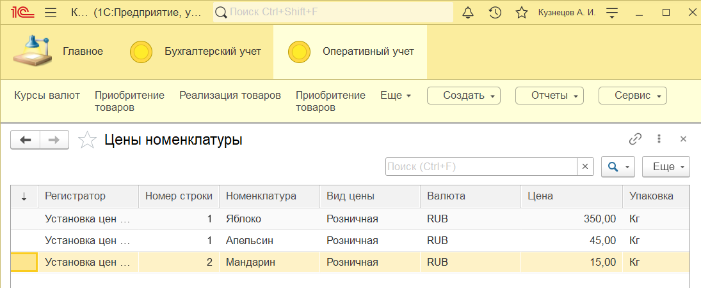
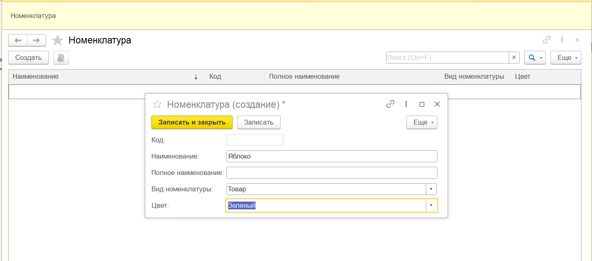
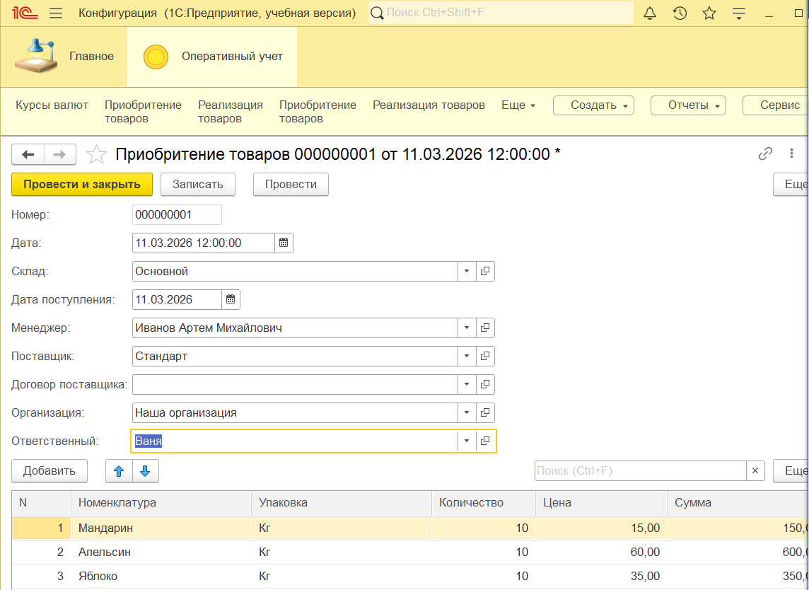
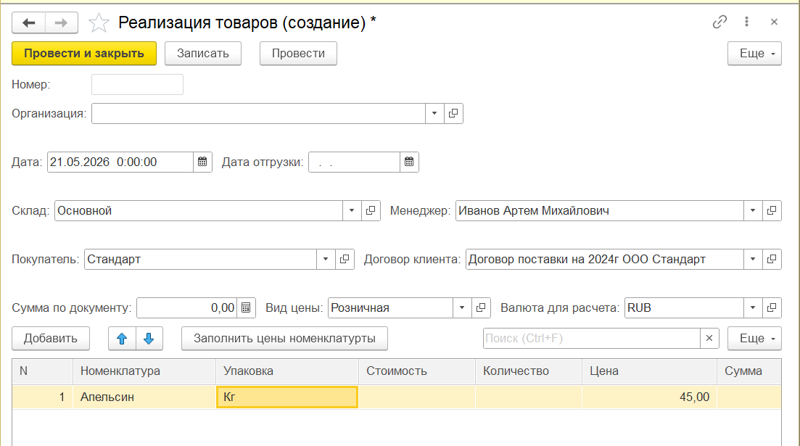
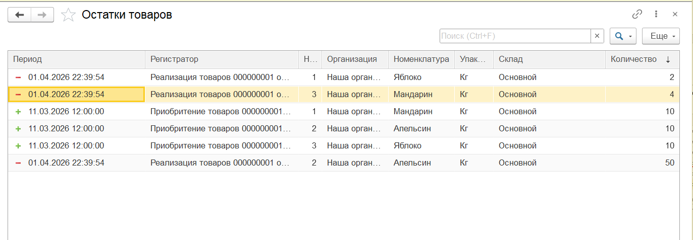
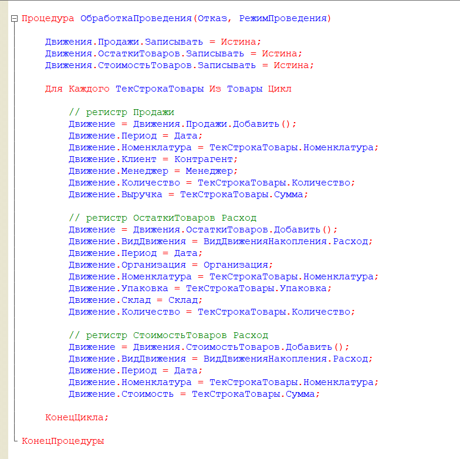
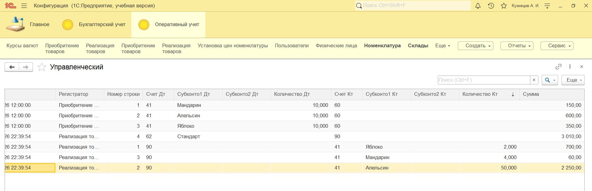
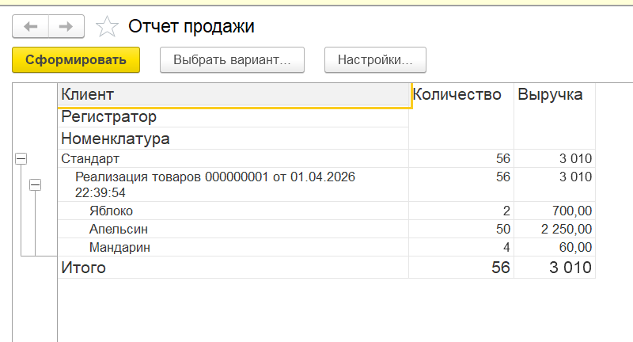

# 1С: учебная система складского и торгового учета

Учебная конфигурация на платформе **1С:Предприятие 8.3**, разработанная для автоматизации базовых складских и торговых операций.

Проект демонстрирует навыки конфигурирования, программирования на встроенном языке 1С, работы с запросами, регистрами, механизмом проведения документов, СКД и разграничением прав доступа.

> Проект является учебным и не предназначен для использования в реальном учете без дополнительного тестирования и доработки.

---

## Назначение проекта

Конфигурация моделирует работу организации, которая осуществляет:

- учет номенклатуры и контрагентов;
- регистрацию поступления и реализации товаров;
- хранение цен номенклатуры;
- количественный и стоимостный учет товарных остатков;
- учет продаж;
- формирование управленческих проводок;
- построение отчетов по остаткам и продажам;
- управление пользователями и правами доступа.

---

## Основные сценарии

### Поступление товаров

Документ `ПриобретениеТоваров` регистрирует поступление номенклатуры и формирует движения:

- по регистру накопления `ОстаткиТоваров`;
- по регистру накопления `СтоимостьТоваров`;
- по регистру бухгалтерии `Управленческий`.

### Реализация товаров

Документ `РеализацияТоваров` используется для оформления продажи и формирует:

- расход товаров со склада;
- списание стоимости товаров;
- обороты по регистру `Продажи`;
- управленческие бухгалтерские проводки.

### Установка цен

Документ `УстановкаЦенНоменклатуры` записывает цены товаров в периодический регистр сведений `ЦеныНоменклатуры`.

Цена хранится в разрезе:

- номенклатуры;
- вида цены;
- валюты;
- даты установки.

### Формирование отчетов

В конфигурации реализованы отчеты:

- по остаткам товаров на складах;
- по продажам;
- на основе языка запросов 1С;
- с использованием виртуальных таблиц регистров;
- с использованием системы компоновки данных.

---

## Реализованные объекты конфигурации

### Справочники

- `Сотрудники`
- `Должности`
- `Склады`
- `Номенклатура`
- `ЕдиницыИзмерения`
- `Контрагенты`
- `ДоговорыКонтрагентов`
- `Валюты`
- `ВидыЦен`
- `Организации`
- вспомогательные справочники складского и учетного контуров

### Документы

- `ПриобретениеТоваров`
- `РеализацияТоваров`
- `УстановкаЦенНоменклатуры`

### Регистры сведений

- `КурсыВалют`
- `ЦеныНоменклатуры`

### Регистры накопления

- `ОстаткиТоваров`
- `СтоимостьТоваров`
- `Продажи`

### Объекты бухгалтерского учета

- план видов характеристик `ВидыСубконто`;
- план счетов `Основной`;
- регистр бухгалтерии `Управленческий`.

---

## Реализованные технические механизмы

- управляемые формы;
- модули объектов и формы;
- клиент-серверное разделение кода;
- обработчики событий;
- проверки заполнения реквизитов;
- табличные части документов и справочников;
- автоматический расчет суммы строки документа;
- автоматическое заполнение единицы измерения;
- заполнение цен номенклатуры запросом;
- параметры запросов;
- конструктор запросов;
- виртуальные таблицы регистров;
- проведение документов;
- движения по нескольким регистрам;
- оборотные регистры накопления;
- бухгалтерские проводки;
- система компоновки данных;
- параметры сеанса и константы;
- роли и пользователи;
- журнал регистрации;
- настройка командного интерфейса.

---

## Скриншоты

### Интерфейс и цены номенклатуры



### Карточка номенклатуры



### Приобретение товаров



### Реализация товаров



### Движения по регистру остатков



### Код проведения документа



### Бухгалтерские движения



### Отчет по продажам на СКД


---

## Структура репозитория

```text
.
├── configuration/
│   └── УчебныйПрактикум.cf
├── docs/
│   ├── architecture.md
│   ├── import_instructions.md
│   ├── project_scope.md
│   └── test_scenarios.md
├── screenshots/
│   ├── 01-main-interface-and-prices.png
│   ├── 02-catalog-nomenclature.png
│   ├── 03-purchase-document.png
│   ├── 04-sales-document.png
│   ├── 05-inventory-register-movements.png
│   ├── 06-document-posting-code.png
│   ├── 07-accounting-register.png
│   └── 08-sales-report-skd.png
├── .gitignore
└── README.md
```

---

## Как открыть конфигурацию

1. Создать новую пустую информационную базу **1С:Предприятие 8.3**.
2. Открыть базу в режиме **Конфигуратор**.
3. Перейти в меню:

   `Конфигурация → Загрузить конфигурацию из файла`

4. Выбрать файл:

   `configuration/УчебныйПрактикум.cf`

5. Подтвердить загрузку конфигурации.
6. Выполнить обновление конфигурации базы данных.
7. Запустить базу в режиме **1С:Предприятие**.

Дополнительная инструкция находится в файле
[`docs/import_instructions.md`](docs/import_instructions.md).

---

## Ограничения репозитория

Файл выгрузки информационной базы `.dt` намеренно не опубликован.

Выгрузка `.dt` может содержать:

- тестовые данные;
- документы и движения;
- пользователей информационной базы;
- настройки;
- журнал регистрации.

В репозитории размещен только файл конфигурации `.cf`, документация и скриншоты.

---

## Возможные доработки

- выгрузка конфигурации в XML-файлы для просмотра исходного кода через GitHub;
- добавление проверки отрицательных остатков перед проведением реализации;
- автоматический расчет себестоимости списываемого товара;
- добавление ER-диаграммы;
- добавление BPMN-схемы складского процесса;
- расширение тестовых сценариев;
- добавление автоматизированного тестирования;
- публикация файла `.cf` через GitHub Releases.

---

## Автор

**Ольга Мялина**

Учебный проект по разработке бизнес-приложений на платформе
**1С:Предприятие 8.3**.